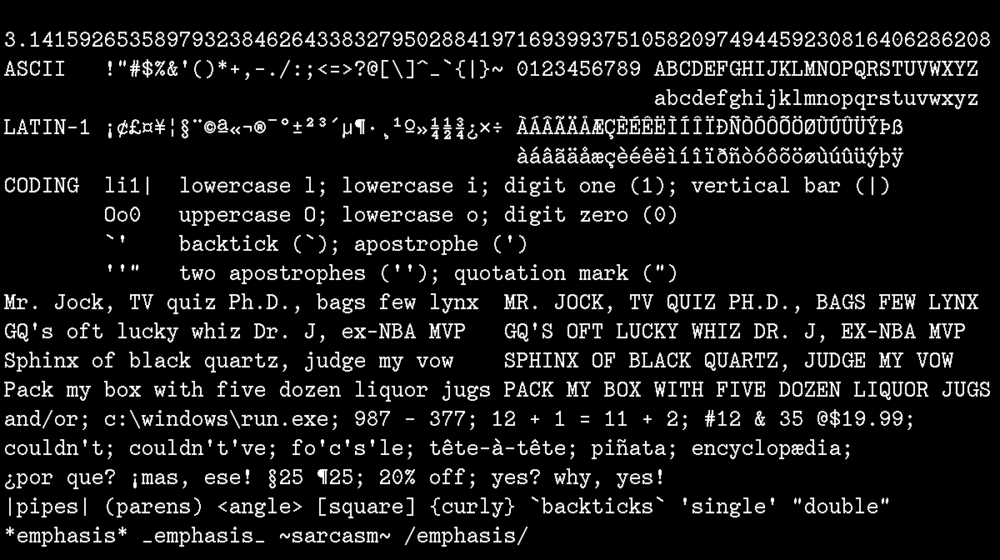
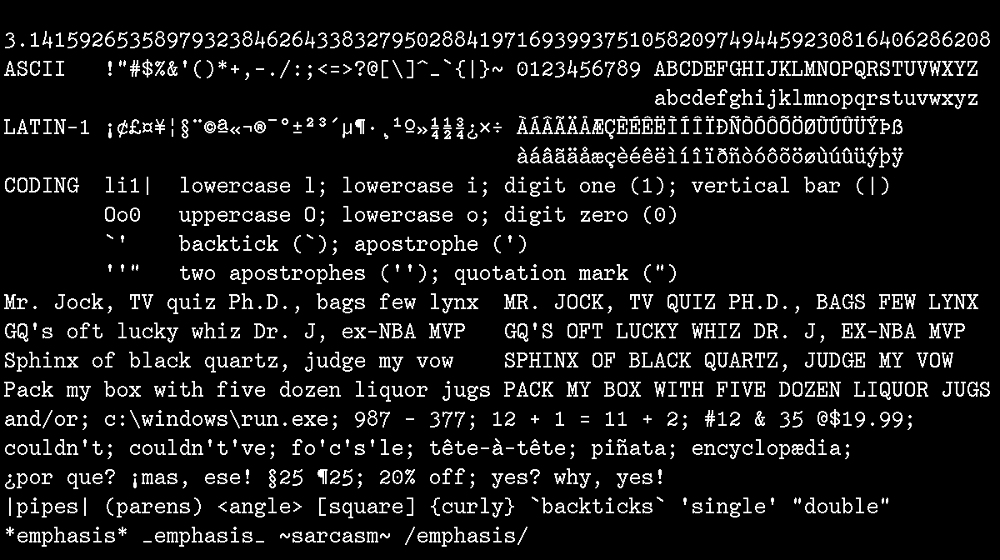

# dse-typewriter-bitmap-font

Bitmap coding font variants inspired by early 20th-century typewriters.

`typewriter` contains lining numerals.

`typewriter-oldstyle` contains old-style numerals.

I made these around 1994–1995 and didn't distribute them or anything
until now.

## Characteristics

-   Full ASCII and Latin-1 coverage.
-   Coding-friendly distinctive characters: `li1|` `Oo0` `` `'" ``

## For Best Results

When using the `.ttf` fonts, specify 21pt in Windows, or 28pt in
macOS/Linux.

## See Also

See <https://github.com/dse/dse-typewriter-font/> for DSE Typewriter,
a similar-looking vector font I created in 2020.

## License

[SIL OFL 1.1](LICENSE.md)

## Preview

